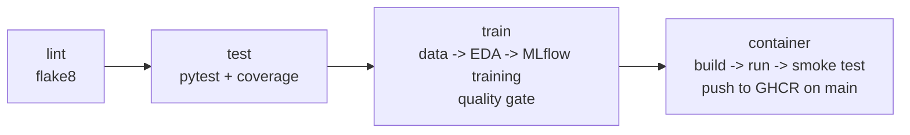

# 3. CI/CD with GitHub Actions

Workflow file: `.github/workflows/ci.yml`

## 3.1 Triggers

| Event | What runs |
|---|---|
| Push to `main` | all 4 jobs, including the image push to GHCR |
| Pull request (any branch) | all 4 jobs, no image push |
| Manual (`workflow_dispatch`) | all 4 jobs; start it from the Actions tab -> ci-cd -> Run workflow |

`concurrency` cancels an older run on the same branch when a new commit arrives.

## 3.2 Jobs



Each job `needs` the previous one, so a failure stops the pipeline at that stage and the run shows a red X. This meets the requirement that the pipeline fail on code or test errors with clear logs.

| Job | Steps | Fails when | Artifacts uploaded |
|---|---|---|---|
| **lint** | install flake8 and lint `heart api tests scripts` | any style/syntax error (e.g. unused import, line > 100 chars) | `lint-report` (flake8 output) |
| **test** | install `requirements.txt`, run `pytest -v` with JUnit and coverage XML | any failing test | `test-reports` (`junit.xml`, `coverage.xml`) |
| **train** | `heart.data` -> `heart.eda` -> `heart.train`; quality gate; job summary | download/training error, or best CV ROC-AUC < 0.85 | `model` (joblib + metadata), `mlflow-runs` (full `mlruns/`), `training-reports` (figures + log) |
| **container** | download `model` artifact -> `docker build` -> `docker run` -> `scripts/smoke_test.py` -> logs -> push | build error, container not healthy in 60s, wrong prediction format, validation not returning 422 | `container-logs` |

The **quality gate** is a small check that blocks the build and publish of a model whose CV ROC-AUC falls below 0.85 (the current best is 0.908). Change the threshold in the "Quality gate" step.

The **job summary** of the train job shows the model comparison table and `metadata.json` directly on the run page.

## 3.3 First run

1. Push the repo to GitHub (see 02_EXTERNAL_TOOLS.md section 2.2).
2. Open **Actions**. The `ci-cd` workflow starts automatically on the push to `main`.
3. Open the run to see four jobs. Click any job to see live logs for each step.
4. When it finishes, scroll to **Artifacts** at the bottom of the run page and download `model`, `mlflow-runs`, `training-reports` and `test-reports`.
5. Under **Packages** on your profile, `heart-api` appears with tags `latest` and the short commit SHA.

Terminal equivalents:
```bash
gh run list --workflow ci-cd
gh run watch                     # follow the latest run live
gh run view --log-failed         # only the logs of failed steps
gh run download <run-id> -n model -D ./ci-model
```

To view the CI experiment runs locally, download `mlflow-runs` and run `mlflow ui --backend-store-uri ./mlruns`.

## 3.4 Permissions and secrets

- No custom secrets are needed.
- The `container` job requests `packages: write` so the built-in `GITHUB_TOKEN` can push to GHCR.
- If the push fails with `denied: installation not allowed`, go to Settings -> Actions -> General -> Workflow permissions and select "Read and write permissions".
- The image name is lowercased in the workflow because GHCR rejects uppercase owner names.

## 3.5 Demonstrating failure handling (worth a screenshot)

Break something on a branch and open a PR:
```bash
git checkout -b demo/failing-test
sed -i '' 's/assert len(df) == 4/assert len(df) == 5/' tests/test_data.py   # Linux: sed -i
git commit -am "demo: break a test" && git push -u origin demo/failing-test
gh pr create --fill
```
The `test` job goes red, `train` and `container` are skipped, and the log points to the exact assertion. Capture the screenshot, then close the PR and delete the branch.

The same works for lint: add `import os` unused at the top of `heart/predict.py` and `flake8` fails with `F401`.

## 3.6 Screenshots for the report
- The workflow run graph with all 4 jobs green.
- The job summary with the training results table.
- The Artifacts list.
- The failing PR run (section 3.5).
- The GHCR package page.

## 3.7 Running the same checks locally before pushing
```bash
make lint test train image run smoke
```

## 3.8 Jenkins alternative (not used)
The assignment allows Jenkins. The same four stages map one-to-one to a declarative `Jenkinsfile` with `stage('Lint')`, `stage('Test')`, `stage('Train')` and `stage('Container')`, using `archiveArtifacts` and `junit 'reports/junit.xml'`. GitHub Actions was chosen because it needs no server to host.
