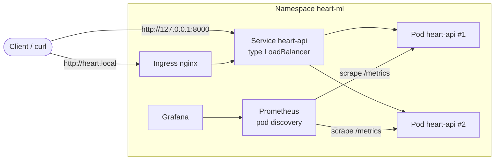

# 4. Container and Kubernetes deployment

## 4.1 Target architecture



| File | Contents |
|---|---|
| `k8s/namespace.yaml` | namespace `heart-ml` |
| `k8s/deployment.yaml` | 2 replicas, rolling update (`maxUnavailable: 0`), readiness + liveness probes on `/health`, CPU/memory requests and limits, non-root user, read-only root filesystem, all capabilities dropped |
| `k8s/service.yaml` | `LoadBalancer` on port 8000 |
| `k8s/ingress.yaml` | nginx Ingress for host `heart.local` |
| `k8s/monitoring/prometheus.yaml` | ServiceAccount + Role (namespace-scoped), config with pod auto-discovery through `prometheus.io/*` annotations, Deployment, Service |
| `k8s/monitoring/grafana.yaml` | Grafana with provisioned datasource and dashboard, admin password from a Secret |
| `k8s/deploy.sh` | builds the ConfigMaps/Secret from `monitoring/` files and applies everything in order |
| `scripts/start_all.ps1` | Windows launcher: builds/loads the image, starts Minikube, applies resources, waits for readiness, and starts local forwards |

## 4.2 Container image

The `Dockerfile` is built on `python:3.12-slim`, installs only the serving dependencies from `api/requirements.txt`, and copies `heart/` (needed to unpickle the custom transformer), `api/` and the trained `models/`. It runs as UID 10001 and starts a single uvicorn process. To scale, Kubernetes adds replicas rather than uvicorn workers, which keeps the Prometheus counters correct per pod.

```powershell
docker build -t localhost/heart-api:local .
docker run --rm -d --name heart-api -p 127.0.0.1:8000:8000 localhost/heart-api:local
python scripts/smoke_test.py --url http://127.0.0.1:8000
docker logs heart-api
docker image ls localhost/heart-api
```

Verified output:
```
health: {'status': 'ok', 'model_name': 'logistic_regression'}
sample_request.json: {'prediction': 1, 'label': 'disease', 'probability_disease': 0.8756, 'confidence': 0.8756, ...}
sample_request_low_risk.json: {'prediction': 0, 'label': 'no_disease', 'probability_disease': 0.069, 'confidence': 0.931, ...}
smoke test passed
```

## 4.3 Start Minikube

```powershell
minikube start --driver=docker --cpus=2 --memory=4096
minikube addons enable ingress
minikube addons enable metrics-server
kubectl get nodes
```
This is the verified Windows path. Podman remains an optional alternative on macOS/Linux.

## 4.4 Load the image into the cluster

Minikube has its own image store, so load the local image into it:
```powershell
docker build -t localhost/heart-api:local .
minikube image load localhost/heart-api:local
minikube image ls | Select-String "heart-api"
```
The Deployment uses `imagePullPolicy: Never`, so a missing image shows up as `ErrImageNeverPull` rather than a slow pull attempt.

Alternatively, build straight inside Minikube with `minikube image build -t localhost/heart-api:local .`.

## 4.5 Deploy

```powershell
Set-ExecutionPolicy -Scope Process Bypass
.\scripts\start_all.ps1
```
The launcher applies the namespace, ConfigMaps, Grafana Secret, API, monitoring, and Ingress resources in the required order. For manual PowerShell commands, use [01_SETUP.md](01_SETUP.md#19-manual-kubernetes-workflow).

Expected: two `heart-api` pods Running and Ready, plus one `prometheus` pod and one `grafana` pod.

## 4.6 Expose and verify the endpoint

**LoadBalancer**: on a laptop cluster, `minikube tunnel` assigns the external IP. Run it in a separate terminal and keep it open; it asks for sudo:
```powershell
minikube tunnel
kubectl -n heart-ml get svc heart-api       # EXTERNAL-IP now set (127.0.0.1 on macOS drivers)
python scripts/smoke_test.py --url http://127.0.0.1:8000
Invoke-WebRequest http://127.0.0.1:8000/model-info
```

**Ingress**:
```powershell
Invoke-WebRequest http://127.0.0.1/health -Headers @{ Host = 'heart.local' }
```
On Windows, adding `heart.local` to the hosts file requires an elevated editor. The explicit Host header is a reliable local fallback.

**Fallbacks** if tunnel/Ingress misbehave:
```powershell
minikube service heart-api -n heart-ml --url
kubectl -n heart-ml port-forward svc/heart-api 8000:8000
```

To demonstrate a rolling update, run:
```powershell
kubectl -n heart-ml rollout restart deployment/heart-api
kubectl -n heart-ml rollout status deployment/heart-api
```
Because `maxUnavailable: 0`, requests keep succeeding throughout.

## 4.7 Using the CI-built image from GHCR instead

```bash
kubectl -n heart-ml create secret docker-registry ghcr \
  --docker-server=ghcr.io --docker-username=<user> --docker-password=<PAT with read:packages>
kubectl -n heart-ml patch deployment heart-api --type=json -p='[
  {"op":"replace","path":"/spec/template/spec/containers/0/image","value":"ghcr.io/<user>/heart-api:latest"},
  {"op":"replace","path":"/spec/template/spec/containers/0/imagePullPolicy","value":"Always"},
  {"op":"add","path":"/spec/template/spec/imagePullSecrets","value":[{"name":"ghcr"}]}]'
```
If the package is public, skip the secret and the `imagePullSecrets` patch.

## 4.8 Public cloud (optional)

The same manifests run unchanged on EKS, GKE or AKS once the image comes from GHCR (section 4.7):

| Cloud | Create cluster | Notes |
|---|---|---|
| AWS EKS | `eksctl create cluster --name heart --nodes 2 --node-type t3.small` | the LoadBalancer Service gets an ELB hostname; install ingress-nginx with Helm for the Ingress |
| GKE | `gcloud container clusters create-auto heart --region asia-south1` | the Service gets a public IP |
| AKS | `az aks create -g rg-heart -n heart --node-count 2 --generate-ssh-keys` | the Service gets a public IP |

Before exposing publicly, add authentication (the API has none) and delete the cluster afterwards to stop charges. For cost estimates, use each provider's pricing calculator.

## 4.9 Screenshots for the report
- `kubectl get nodes` and `kubectl -n heart-ml get all,ingress`
- `kubectl -n heart-ml describe pod <heart-api-pod>` (probes, limits)
- the `minikube tunnel` terminal next to a successful API request
- a PowerShell request through the Ingress with the `heart.local` Host header
- Swagger UI at `/docs` executing a prediction
- `minikube dashboard` workloads view (optional)

## 4.10 Troubleshooting

| Symptom | Fix |
|---|---|
| `ErrImageNeverPull` | run `docker build -t localhost/heart-api:local .` and `minikube image load localhost/heart-api:local` |
| Pod `CrashLoopBackOff` | `kubectl -n heart-ml logs <pod> --previous`; usually the model was missing at build time, so rebuild the image and load it into Minikube |
| Pod Running but not Ready | the `/health` probe returns 503, which means the model did not load; check the logs for `model_missing` |
| Service `EXTERNAL-IP <pending>` | `minikube tunnel` is not running |
| Ingress 404 | the Host header must be `heart.local`; check `kubectl -n heart-ml get ingress` |
| Minikube Docker driver error | Confirm Docker Desktop is running, then retry `minikube start --driver=docker` |

## 4.11 Teardown
```powershell
kubectl delete namespace heart-ml --ignore-not-found
minikube stop              # or: minikube delete
```
