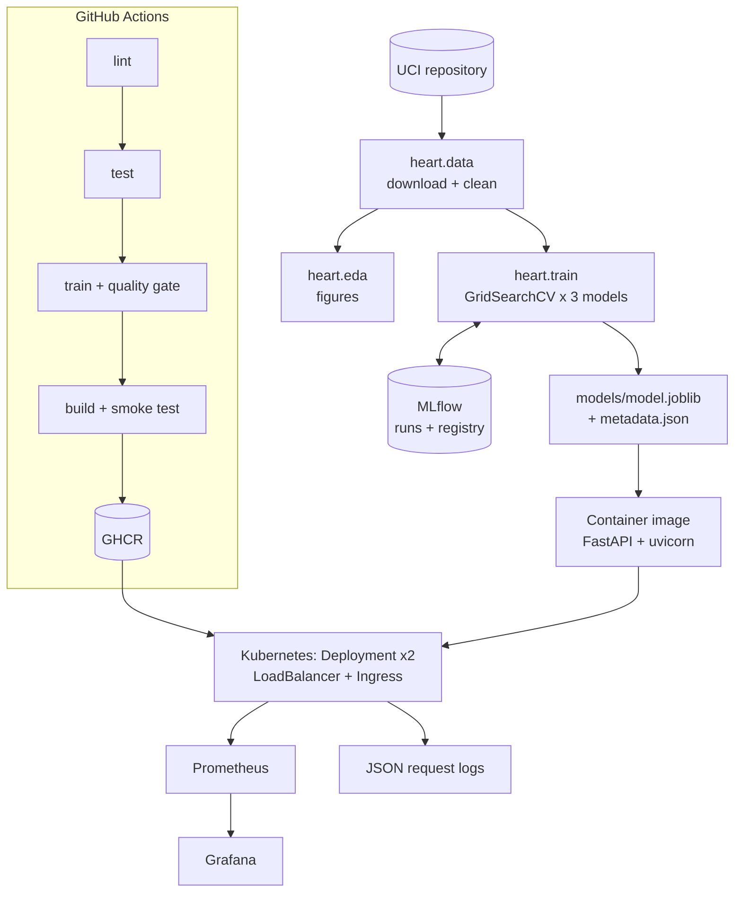

# Heart Disease Risk Prediction: MLOps Assignment 1 Report

**Course:** MLOps (AIMLCZG523) · **Name / ID:** _<fill>_ · **Repository:** _<https://github.com/<user>/heart-disease-mlops>_ · **Video:** _<link>_

> This is a draft. Export it to PDF/DOCX (for example `pandoc docs/REPORT.md -o report.docx`) and paste in the screenshots from `screenshots/`. Rewrite the observations in your own words before submitting.

## 1. Problem and approach
The task is to predict the presence of heart disease from 13 clinical attributes and serve that prediction as a monitored, reproducible API. The project is built as a Python package (`heart/`) that the scripts, notebooks, tests, CI and API all import, so one set of code runs everywhere.

## 2. Architecture

_(Insert a rendered PNG of this diagram. Paste the mermaid code into https://mermaid.live to export it.)_

## 3. Data acquisition and EDA
- Source: the UCI Cleveland file (`processed.cleveland.data`) with 303 rows, downloaded by `python -m heart.data`.
- Cleaning: `?` is read as missing (`ca` has 4, `thal` has 2) and every column is converted to numeric. The 0-4 diagnosis becomes a binary target. No duplicate rows were found.
- Missing values are imputed **inside the model pipeline** (median/most-frequent), fitted per CV fold, to avoid leakage.
- Class balance: 164 without disease (54%) and 139 with disease (46%), which is mild imbalance.
- Strongest correlations with the target: `thal` 0.53, `ca` 0.46, `exang` 0.43, `oldpeak` 0.43, `cp` 0.41, `thalach` -0.42. `fbs` (0.03) and `chol` (0.09) are weak.
- Categorical insight: asymptomatic chest pain (`cp=4`) has a 73% disease rate against 18-30% for the other types, and a reversible thal defect has 76%.

Figures: `eda_class_balance.png`, `eda_numeric_histograms.png`, `eda_categorical_rates.png`, `eda_correlation_heatmap.png`, `eda_outliers.png`.

## 4. Feature engineering and modelling
- **Pipeline:** the `ClinicalFeatures` step adds `hr_reserve = thalach / (220 - age)` (the share of age-predicted maximum heart rate reached) and `chol_per_age`. Numeric columns get median imputation and standard scaling. Nominal codes (`cp`, `restecg`, `slope`, `thal`) get most-frequent imputation and one-hot encoding. Binary columns are imputed only.
- **Split:** a stratified 80/20 split (242 train, 61 test) with `random_state=42`. The test set is only used after model selection.
- **Tuning:** `GridSearchCV` with stratified 5-fold CV, scoring accuracy, precision, recall, F1 and ROC-AUC, and refitting on ROC-AUC.

| Model | Grid searched | Best params |
|---|---|---|
| Logistic Regression | C in {0.01, 0.1, 0.3, 1, 3} x class_weight in {None, balanced} | C=0.3, balanced |
| Random Forest | n_estimators {200, 400} x max_depth {None, 4, 8} x min_samples_leaf {1, 3, 5} | 400, None, 5 |
| Gradient Boosting | n_estimators {100, 200} x learning_rate {0.03, 0.1} x max_depth {2, 3} | 100, 0.03, 2 |

| Model | CV acc | CV prec | CV recall | CV F1 | CV ROC-AUC | Test ROC-AUC |
|---|---|---|---|---|---|---|
| **Logistic Regression** | **0.847** | **0.879** | **0.783** | **0.824** | **0.908** | **0.960** |
| Random Forest | 0.810 | 0.825 | 0.756 | 0.783 | 0.895 | 0.956 |
| Gradient Boosting | 0.810 | 0.822 | 0.765 | 0.786 | 0.881 | 0.950 |

**Selection:** Logistic Regression had the best CV ROC-AUC (the selection metric), and it is also the most interpretable model. With under 250 training rows and mostly linear signals, the tree ensembles gave no gain. On the hold-out set it scored accuracy 0.869, precision 0.813, recall 0.929 and F1 0.867 (TP 26, FN 2, FP 6, TN 27). High recall matters most for a screening use case, because a missed disease case costs far more than a false alarm.

**Most important features** (absolute coefficient): `ca`, `sex`, `cp=4`, `thal=7`, `thal=3`, `exang`.

## 5. Experiment tracking (MLflow)
- The experiment `heart-disease-classification` has one parent run `model-selection` and 3 nested runs.
- Logged per run: best params, `cv_*` mean and std, `test_*`, the confusion matrix, ROC curve, feature importance, the full `cv_results.csv`, and the model with its signature and input example.
- The best model is registered as `heart-disease-classifier` (the version increments on each training run).
- _Screenshots: experiment list, 3-run comparison chart, artifacts view, model registry._

## 6. Packaging and reproducibility
- `models/model.joblib` holds the complete preprocessing and classifier pipeline, and the MLflow model format holds it as well. `metadata.json` records the metrics, versions and run id.
- Pinned `requirements.txt` for development and `api/requirements.txt` for serving; fixed random seeds.
- A clean-setup proof runs in CI: a fresh runner installs from `requirements.txt`, downloads the data, trains, builds and tests.

## 7. CI/CD and testing
- 29 pytest tests: data (5), features (5), model (9), API (10). They use synthetic fixtures, so they do not depend on the network.
- GitHub Actions runs lint -> test -> train (with a quality gate of ROC-AUC >= 0.85) -> container build, smoke test and push to GHCR.
- Artifacts per run: lint report, JUnit and coverage XML, model, mlruns, figures, container logs.
- _Screenshots: green run graph, job summary, artifacts, a deliberately failing PR._

## 8. Containerisation and deployment
- FastAPI endpoints: `/predict` (JSON in; prediction, label, probability and confidence out), `/health`, `/model-info`, `/metrics`. Pydantic validates ranges and allowed codes and returns 422 on bad input.
- Image: `python:3.12-slim`, non-root, about 520 MB, verified with `scripts/smoke_test.py`.
- Kubernetes on Minikube: 2 replicas, rolling updates, probes, resource limits, read-only root filesystem, a LoadBalancer Service (via `minikube tunnel`) and an nginx Ingress (`heart.local`).
- _Screenshots: `kubectl get all,ingress`, curl through the LoadBalancer and the Ingress, Swagger UI._

## 9. Monitoring and logging
- One JSON log line per request (request id, path, status, latency) and per prediction.
- Prometheus metrics: request counter, latency histogram, prediction-label counter, probability histogram, model-loaded gauge. Pods are auto-discovered in Kubernetes.
- The Grafana dashboard shows traffic, error and validation rates, p50/p95 latency, the prediction mix, and the mean predicted probability as a drift signal.
- _Screenshots: Prometheus targets, Grafana dashboard under generated traffic._

## 10. Limitations and next steps
- The dataset is small (303 rows, one hospital), so there is uncertainty in the metrics (CV ROC-AUC std is about 0.02) and in generalisation.
- The API has no authentication; add an API key or OAuth proxy before any public exposure.
- Drift detection is a probability-mean signal only; Evidently or a similar tool could add feature-level drift reports.
- The model is baked into the image; a next step is to load `models:/heart-disease-classifier/Production` from an MLflow server at startup.

## Appendix: how to run
See `README.md` and `docs/01_SETUP.md` through `docs/05_MONITORING.md`.
