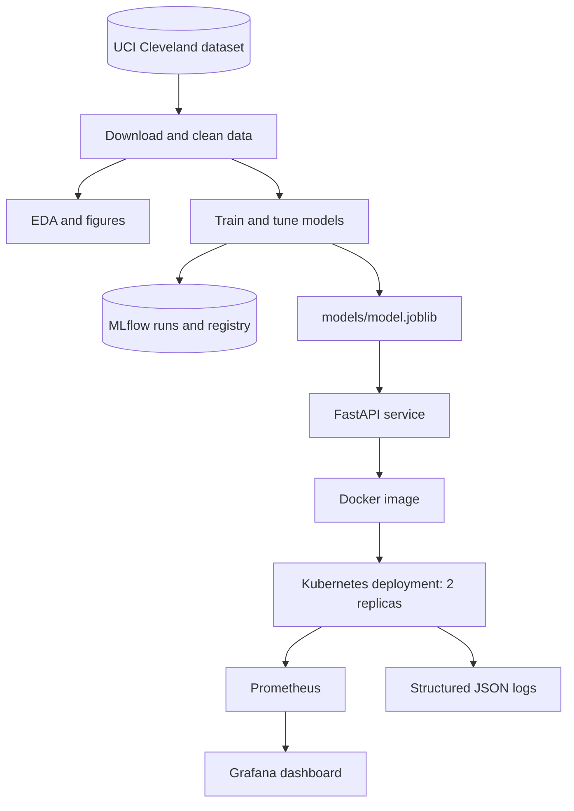
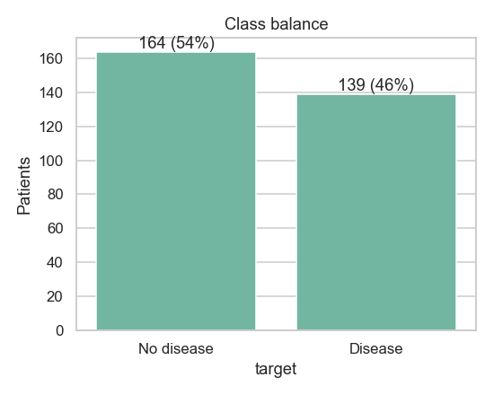
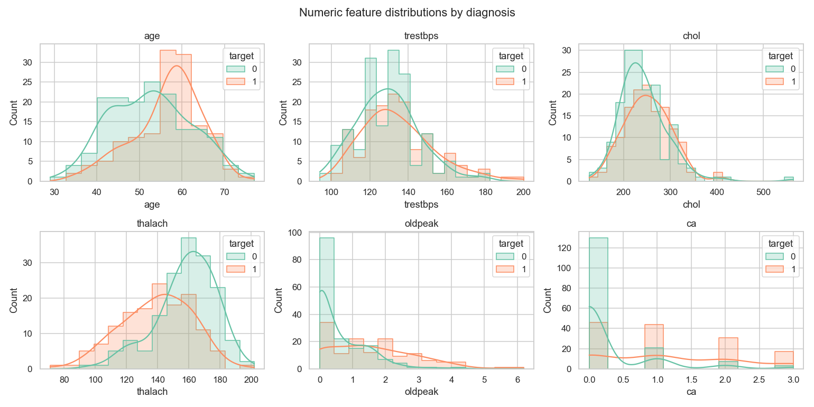
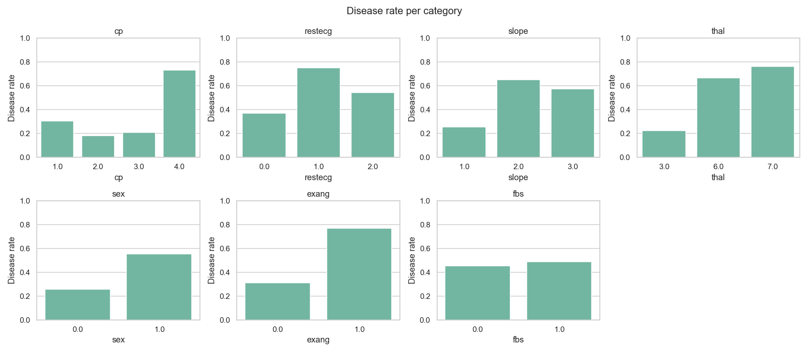
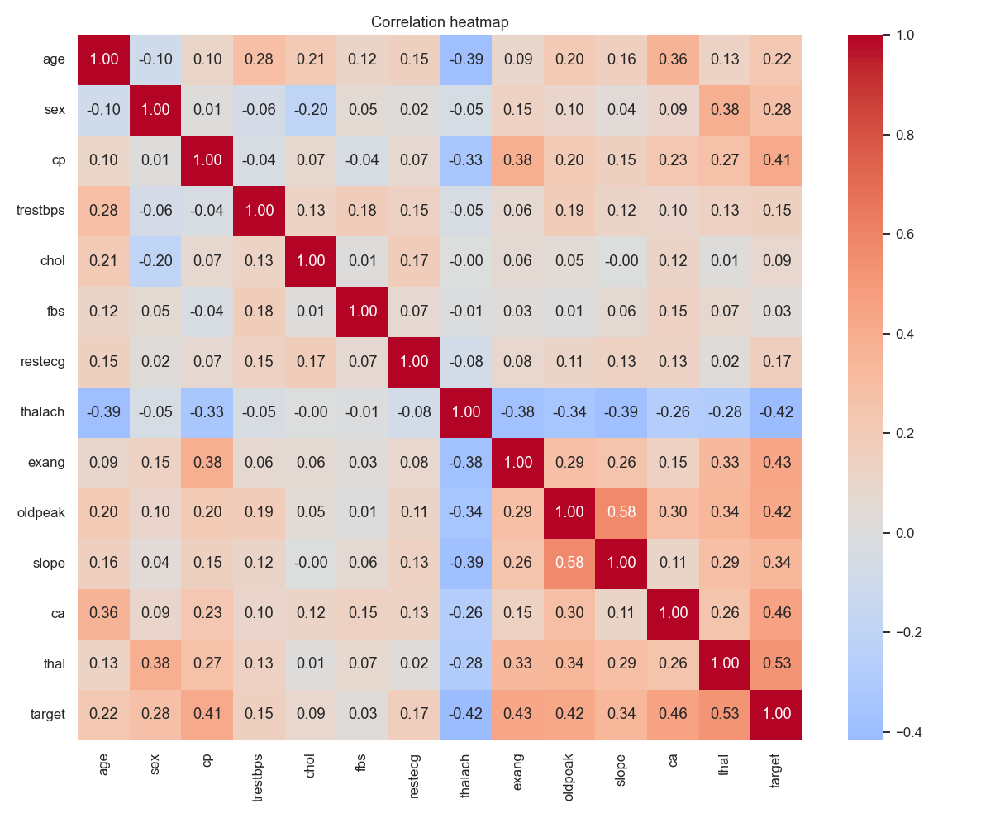
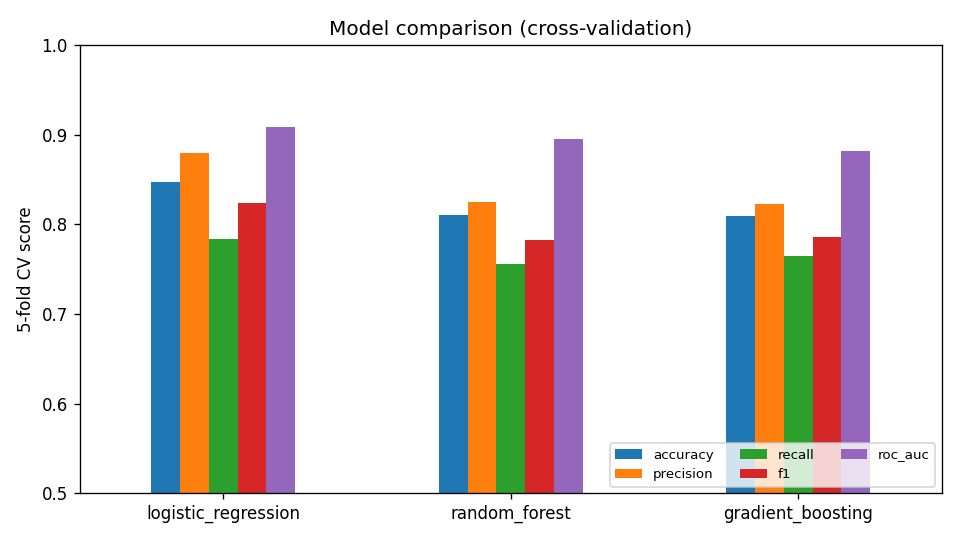
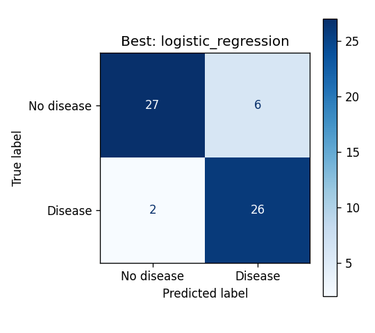
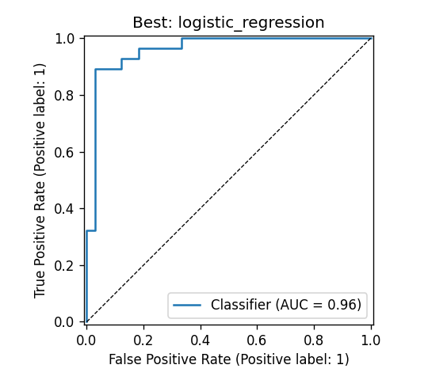
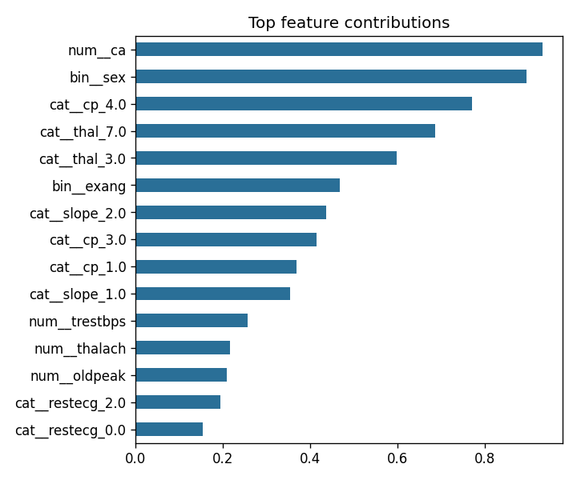
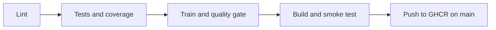

# Heart Disease Risk Prediction — MLOps Assignment 1

**Course:** MLOps (AIMLCZG523)  
**Student:** Kush Gunendrasing Munot (2025AE05915)  
**Repository:** https://github.com/Kush-munot/heart-disease-mlops  
**Demo video:** https://wilpbitspilaniacin0-my.sharepoint.com/:v:/g/personal/2025ae05915_wilp_bits-pilani_ac_in/IQDN2UoJowRAT5bRj-e8uQXwAWYs3LOH2Dwh5nXt6ajqDLc?nav=eyJyZWZlcnJhbEluZm8iOnsicmVmZXJyYWxBcHAiOiJPbmVEcml2ZUZvckJ1c2luZXNzIiwicmVmZXJyYWxBcHBQbGF0Zm9ybSI6IldlYiIsInJlZmVycmFsTW9kZSI6InZpZXciLCJyZWZlcnJhbFZpZXciOiJNeUZpbGVzTGlua0NvcHkifX0&e=E95OZA

## Executive summary

This project turns a small clinical dataset into a reproducible machine-learning service. The model predicts whether a patient is likely to have heart disease, and the prediction is exposed through a FastAPI endpoint.

The important part is not only the model score. The same project also shows how the model can be tested, packaged into a container, deployed to Kubernetes, monitored with Prometheus and Grafana, and tracked with MLflow. In other words, the project follows the model from raw data to a running service.

The selected model is a balanced Logistic Regression pipeline. It achieved a cross-validation ROC-AUC of **0.908** and a hold-out ROC-AUC of **0.960**. On the hold-out set it achieved **0.869 accuracy**, **0.813 precision**, **0.929 recall**, and **0.867 F1**.

## 1. Problem and objective

The objective is to predict the presence of heart disease from 13 clinical attributes from the UCI Cleveland heart-disease dataset. The prediction is binary:

- `0` — no disease
- `1` — disease

The service returns both the predicted class and a probability. This makes the result easier to interpret than a class label alone. For example, a screening application can decide whether a high-probability case should receive further clinical attention.

This is an educational project, not a medical diagnostic tool. The dataset is small and comes from one source, so the results should not be treated as evidence of clinical performance in a different hospital or population.

## 2. System overview

The project is organised as one pipeline rather than separate pieces of experimental code and production code. Data preparation, feature engineering, model training, testing, serving, and monitoring all use the same package code.



The runtime architecture is deliberately simple. Kubernetes runs two API replicas behind a Service. Prometheus discovers the replicas through pod annotations, and Grafana reads the metrics from Prometheus. This keeps the deployment understandable while still demonstrating the main production concerns.

## 3. Data preparation and exploratory analysis

The raw Cleveland file contains **303 rows**. Missing values are represented by `?`; these are converted to missing values before the columns are converted to numeric types. The diagnosis values `0` through `4` are then converted into the binary target used by the model.

The cleaned dataset contains **164 no-disease cases** and **139 disease cases**. That is a mild class imbalance, so the selected Logistic Regression model uses balanced class weights.

Missing-value imputation is part of the scikit-learn pipeline. This matters because the imputer is fitted separately inside each cross-validation fold. Imputing the whole dataset before cross-validation would allow information from the validation fold to leak into training.

### EDA observations

The strongest relationships with the target are associated with `thal`, `ca`, `exang`, `oldpeak`, `cp`, and `thalach`. Some simple clinical patterns are also visible: asymptomatic chest pain has a higher disease rate than the other chest-pain categories, and reversible thallium defects are associated with a higher disease rate.

The charts below are the saved project figures used to support these observations.



*Figure 1. The target is mildly imbalanced, but both classes have enough examples for a stratified split.*



*Figure 2. Numeric feature distributions used to understand scale, skew, and possible outliers.*



*Figure 3. Disease rate by selected categorical clinical variables.*



*Figure 4. Correlations between the cleaned variables and the binary target.*

## 4. Feature engineering and model development

The data is split into **242 training rows** and **61 hold-out test rows** using a stratified 80/20 split with `random_state=42`. The hold-out set is kept untouched until the final evaluation.

The feature pipeline performs the following work:

1. Adds `hr_reserve`, which compares achieved heart rate with an age-predicted maximum.
2. Adds `chol_per_age` as a simple age-adjusted cholesterol feature.
3. Imputes numeric and categorical values using separate strategies.
4. Standardises numeric variables.
5. One-hot encodes nominal categorical variables.
6. Fits the classifier only after all preprocessing steps are inside the pipeline.

Three models were compared with stratified five-fold `GridSearchCV`:

| Model | Selected configuration | CV accuracy | CV precision | CV recall | CV F1 | CV ROC-AUC | Test ROC-AUC |
|---|---|---:|---:|---:|---:|---:|---:|
| **Logistic Regression** | `C=0.3`, balanced weights | **0.847** | **0.879** | **0.783** | **0.824** | **0.908** | **0.960** |
| Random Forest | 400 trees, minimum leaf size 5 | 0.810 | 0.825 | 0.756 | 0.783 | 0.895 | 0.956 |
| Gradient Boosting | 100 estimators, learning rate 0.03, depth 2 | 0.810 | 0.822 | 0.765 | 0.786 | 0.881 | 0.950 |



*Figure 5. Logistic Regression gives the strongest cross-validation result and the best hold-out ROC-AUC.*

Logistic Regression was selected because it performed best on the chosen selection metric and remains relatively easy to interpret. Its hold-out recall was **0.929**, meaning it missed only two of the 28 positive cases in the test set. For a screening-oriented example, that is preferable to choosing a model with slightly fewer false alarms but more missed positive cases.



*Figure 6. Hold-out confusion matrix for the selected model.*



*Figure 7. Hold-out ROC curve for the selected model.*



*Figure 8. Largest absolute model coefficients for the selected pipeline.*

## 5. Experiment tracking with MLflow

The experiment is named `heart-disease-classification`. The training run contains one parent run called `model-selection` and three nested candidate runs:

- `logistic_regression`
- `random_forest`
- `gradient_boosting`

Each candidate records its parameters, cross-validation metrics, hold-out metrics, and model metadata. The selected model is registered as `heart-disease-classifier`, version 1 in the local experiment store.

The repository also contains the MLflow evaluation artifacts, including the confusion matrix, ROC curve, feature-importance figure, cross-validation results, and serialized model. The saved model is additionally copied to `models/model.joblib` for serving.

### Runtime screenshot evidence

The local verification run captured the MLflow experiment view, the registered-model view, Swagger prediction output, Prometheus targets, and the Grafana dashboard. The repository currently contains the screenshot checklist in `screenshots/README.md`, but the runtime PNG files have not been copied into `screenshots/` yet. Add them there using the filenames below before exporting the final report:

| File | Evidence |
|---|---|
| `01_mlflow_experiments.png` | Parent run and three nested model runs |
| `04_mlflow_registry.png` | Registered model and version 1 |
| `05_pytest.png` | Passing test output |
| `10_container_smoke.png` | Container smoke test |
| `11_k8s_resources.png` | Kubernetes resources and Ingress |
| `12_k8s_predict_lb.png` | Prediction through the LoadBalancer/port-forward |
| `13_k8s_ingress.png` | Prediction through the `heart.local` Ingress |
| `14_swagger.png` | Successful prediction from Swagger UI |
| `15_prometheus_targets.png` | API targets shown as UP |
| `16_grafana_dashboard.png` | Dashboard populated with generated traffic |
| `17_json_logs.png` | Structured JSON request logs |

## 6. Packaging and reproducibility

The serving image is based on `python:3.12-slim` and installs only the API dependencies. It copies the model pipeline and the Python package required to unpickle the custom transformer. The container runs as a non-root user.

The model package is reproducible because:

- development and serving dependencies are pinned in requirements files;
- the train/test split and model searches use fixed random seeds;
- preprocessing is stored with the classifier in the joblib pipeline;
- `models/metadata.json` records the selected model, metrics, training time, and MLflow run information;
- the CI workflow trains from a clean checkout before building the image.

## 7. Testing and CI/CD

The local test run completed with **29 passed tests**. The test suite covers data cleaning, feature engineering, model behaviour, validation, and API responses. Flake8 also completed successfully.

The GitHub Actions workflow is intentionally sequential:



The training job has a quality gate requiring CV ROC-AUC to be at least `0.85`. The current model reaches `0.908`, so it passes the gate. If linting, tests, training, the quality gate, or the container smoke test fails, later jobs are skipped.

The workflow also uploads useful artifacts: lint output, JUnit and coverage reports, the trained model, MLflow runs, training figures, and container logs.

## 8. Container and Kubernetes deployment

The Docker image was built successfully as `localhost/heart-api:local`. The standalone container returned the expected results for both a higher-risk and a lower-risk sample:

```text
health: {'status': 'ok', 'model_name': 'logistic_regression'}
sample_request.json: prediction=1, label=disease, probability_disease=0.8756
sample_request_low_risk.json: prediction=0, label=no_disease, probability_disease=0.069
smoke test passed
```

The Kubernetes deployment uses two API replicas. Each pod has readiness and liveness probes on `/health`, CPU and memory requests/limits, a read-only root filesystem, a non-root user, and dropped Linux capabilities. The rolling-update strategy uses `maxUnavailable: 0`, so an update can replace pods without intentionally reducing the available replica count.

The local deployment was verified with:

- two `heart-api` pods in `Running` and `Ready` state;
- one Prometheus pod and one Grafana pod;
- a LoadBalancer Service with a local external address after starting `minikube tunnel`;
- an nginx Ingress for `heart.local`;
- successful health and prediction requests;
- a successful rolling restart of the API deployment.

On this Windows machine, the Ingress was tested with an explicit `Host: heart.local` header because editing the system hosts file requires administrator permission. The Kubernetes port-forward remains the simplest repeatable local Swagger route.

## 9. Monitoring and logging

The API exposes Prometheus metrics at `/metrics`. The metrics include request totals, request duration, prediction counts, disease-probability distribution, and a model-loaded gauge.

The API writes one JSON object per request. A typical entry contains the request ID, HTTP method, path, status code, latency, and client address. Prediction events additionally record the class label, probability, and confidence. This format is easy to send to a log collector later.

During verification, generated traffic populated the Grafana dashboard. The dashboard showed request rate, validation errors, latency, prediction mix, mean predicted probability, total predictions, and model-loaded status. Prometheus reported both API replicas as UP.

## 10. Limitations and next steps

The main limitation is the dataset itself: 303 rows from one source are not enough to establish reliable clinical generalisation. The reported metrics are useful for demonstrating the MLOps workflow, but they should not be interpreted as a medical validation study.

The API also has no authentication. It binds to localhost in the local setup, but an API key, OAuth proxy, or gateway would be required before public exposure. The current drift signal is based on prediction probabilities; a future version could add feature-level drift checks with a tool such as Evidently.

Finally, the model is currently packaged into the image. A more flexible production design would load a specific approved model version from an MLflow server at startup, with an explicit rollback process.

## 11. Reproducing the local demonstration

On Windows with Docker Desktop, the shortest path is:

```powershell
Set-ExecutionPolicy -Scope Process Bypass
.\scripts\start_all.ps1
```

The launcher builds the image, starts Minikube, enables the required addons, loads the image into Minikube, applies the Kubernetes resources, waits for the deployments, and starts the API, Prometheus, Grafana, and tunnel port-forwards.

Open:

| Service | URL |
|---|---|
| Swagger UI | http://127.0.0.1:8000/docs |
| Prometheus targets | http://127.0.0.1:9090/targets |
| Grafana | http://127.0.0.1:3000 |
| MLflow | http://127.0.0.1:5000 |

Grafana uses the local credentials configured by the launcher.

To stop the local cluster after the demonstration:

```powershell
minikube stop
```

For the final submission, add the runtime screenshots listed in Section 5 and add the short demonstration-video link at the top of this document.
